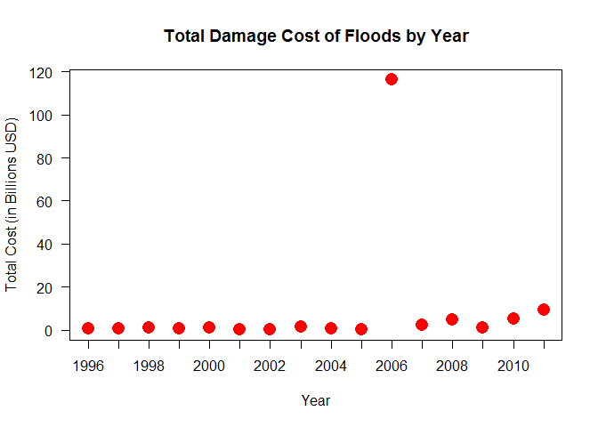

# NOAA Storm Data Analysis - Most Harmful and Most Expensive Storm Events
Eddo W. Hintoso  
August 14, 2015  

# Synopsis
This data analysis attempts to address the following questions:  
1. Across the United States, which types of events (as indicated in the EVTYPE variable) are most harmful with respect to population health?  
2. Across the United States, which types of events have the greatest economic consequences?

The U.S. National Oceanic and Atmospheric Administration’s (NOAA) storm database was analysed to answer these questions. Storm data from 1996 to 2011 was used, in order to minimize bias due to limited data being collect in previous years. Using recent data also minimized the effects of inflation on the cost of the damage due to the events.

To see the software conditions used to complete this data analysis, see the section **Software Conditions**.

**NOTE**: The global options are set to cache the computations so that the `.Rmd` file can be knitted to HTML faster.

```r
library(knitr)
opts_chunk$set(cache = TRUE)
```

# Data Processing

## Validating Pre-Existence of Data

```r
##  check if file exists; if not, download the file again
if(!file.exists("repdata-data-StormData.csv.bz2")){
    message("Downloading data")
    fileURL <- "https://d396qusza40orc.cloudfront.net/repdata%2Fdata%2Factivity.zip"
    download.file(fileURL, destfile = "./repdata-data-StormData.csv.bz2", method = "curl")
}
```

## Reading the Data

```r
##  read data
storm <- read.csv('repdata-data-StormData.csv.bz2')

##  store it as 'tbl_df' for faster processing
library(dplyr)
storm <- tbl_df(storm)
```

## Cleaning the Data
According to the [information](http://www.ncdc.noaa.gov/stormevents/details.jsp) on the Storm Events Database provided, the events types available are:  
1. *Tornado*: From 1950 through 1954, only tornado events were recorded.  
2. *Tornado, Thunderstorm Wind and Hail*: From 1955 through 1992, only tornado, thunderstorm wind and hail events were keyed from the paper publications into digital data. From 1993 to 1995, only tornado, thunderstorm wind and hail events have been extracted from the [Unformatted Text Files](http://www.ncdc.noaa.gov/stormevents/details.jsp?type=collection).  
3. *All Event Types (48 from Directive 10-1605)*: From 1996 to present, 48 event types are recorded as defined in [NWS Directive 10-1605](http://www.ncdc.noaa.gov/stormevents/pd01016005curr.pdf). 

As mentioned in the synopsis before, only storm data from 1996 to 2011 was used, in order to minimize bias due to limited data being collect in previous years. Using recent data also minimized the effects of inflation on the cost of the damage due to the events. But first, we need to check if the dates stored are in the `Date` format.

```r
##  transform BGN_DATE into Date format
if (class(storm$BGN_DATE) != "Date") {
    storm <- tbl_df(transform(storm, BGN_DATE = as.Date(storm$BGN_DATE, format = "%m/%d/%Y")))
}

##  confirm BGN_DATE is in Date format
class(storm$BGN_DATE)
```

```
## [1] "Date"
```

Now, to filter out the data before 1996,

```r
##  set cutoff date and filter
dateCutoff <- as.Date("1996-01-01", format = "%Y-%m-%d")
storm <- subset(storm, BGN_DATE >= dateCutoff)

##  confirm date is from 1996-01-01 onwards
head(storm$BGN_DATE, 4)
```

```
## [1] "1996-01-06" "1996-01-11" "1996-01-11" "1996-01-11"
```
Since the dates are listed in chronological order, we can see that the data is indeed only 1996 onwards.

### Column Filter
Needless to say, some variables in the data would not contribute to the analysis that would answer the questions posed. Therefore, those columns have to be filtered out as well - but not before checking every variable and evaluating which ones to keep.

```r
##  display all variables
names(storm)
```

```
##  [1] "STATE__"    "BGN_DATE"   "BGN_TIME"   "TIME_ZONE"  "COUNTY"    
##  [6] "COUNTYNAME" "STATE"      "EVTYPE"     "BGN_RANGE"  "BGN_AZI"   
## [11] "BGN_LOCATI" "END_DATE"   "END_TIME"   "COUNTY_END" "COUNTYENDN"
## [16] "END_RANGE"  "END_AZI"    "END_LOCATI" "LENGTH"     "WIDTH"     
## [21] "F"          "MAG"        "FATALITIES" "INJURIES"   "PROPDMG"   
## [26] "PROPDMGEXP" "CROPDMG"    "CROPDMGEXP" "WFO"        "STATEOFFIC"
## [31] "ZONENAMES"  "LATITUDE"   "LONGITUDE"  "LATITUDE_E" "LONGITUDE_"
## [36] "REMARKS"    "REFNUM"
```
From this, we can decide to keep only the variables shown below and accordingly filter into a new variable `newStorm`:

```r
##  create character vector of useful variables
neededCols <- c("BGN_DATE", "STATE", "EVTYPE", "BGN_LOCATI", "FATALITIES", "INJURIES", "PROPDMG", "PROPDMGEXP", "CROPDMG", "CROPDMGEXP", "REMARKS", "REFNUM")

##  filter variables in storm data
newStorm <- storm[, neededCols]

##  confirm variable column filter
names(newStorm)
```

```
##  [1] "BGN_DATE"   "STATE"      "EVTYPE"     "BGN_LOCATI" "FATALITIES"
##  [6] "INJURIES"   "PROPDMG"    "PROPDMGEXP" "CROPDMG"    "CROPDMGEXP"
## [11] "REMARKS"    "REFNUM"
```

### Row Filter
The numeric values of columns `FATALITIES`,`INJURIES`,`PROPDMG`, and `CROPDMG`, will be no of use when all of them are equal to 0, since it is quantifiably speaking, not contributing to the harm of population health or the economy. That being said, certain rows will be filtered out from the data.

```r
##  remove rows with no damage whatsoever
newStorm <- subset(newStorm, !(FATALITIES<=0 & INJURIES<=0 &PROPDMG<=0 & CROPDMG<=0))
```

### Event Type Regroup
Let us examine the `EVTYPE` variable and see how many different event types we get out of it.

```r
##  list every different event types
unique(newStorm$EVTYPE)
```

```
##   [1] WINTER STORM              TORNADO                  
##   [3] TSTM WIND                 HIGH WIND                
##   [5] FLASH FLOOD               FREEZING RAIN            
##   [7] EXTREME COLD              LIGHTNING                
##   [9] HAIL                      FLOOD                    
##  [11] TSTM WIND/HAIL            EXCESSIVE HEAT           
##  [13] RIP CURRENTS              Other                    
##  [15] HEAVY SNOW                WILD/FOREST FIRE         
##  [17] ICE STORM                 BLIZZARD                 
##  [19] STORM SURGE               Ice jam flood (minor     
##  [21] DUST STORM                STRONG WIND              
##  [23] DUST DEVIL                Tstm Wind                
##  [25] URBAN/SML STREAM FLD      FOG                      
##  [27] ROUGH SURF                Heavy Surf               
##  [29] Dust Devil                HEAVY RAIN               
##  [31] Marine Accident           AVALANCHE                
##  [33] Freeze                    DRY MICROBURST           
##  [35] Strong Wind               WINDS                    
##  [37] COASTAL STORM             Erosion/Cstl Flood       
##  [39] River Flooding            WATERSPOUT               
##  [41] DAMAGING FREEZE           Damaging Freeze          
##  [43] HURRICANE                 TROPICAL STORM           
##  [45] Beach Erosion             High Surf                
##  [47] Heavy Rain/High Surf      Unseasonable Cold        
##  [49] Early Frost               Wintry Mix               
##  [51] Extreme Cold              DROUGHT                  
##  [53] Coastal Flooding          Torrential Rainfall      
##  [55] Landslump                 Hurricane Edouard        
##  [57] Coastal Storm             TIDAL FLOODING           
##  [59] Tidal Flooding            Strong Winds             
##  [61] EXTREME WINDCHILL         Glaze                    
##  [63] Extended Cold             Whirlwind                
##  [65] Heavy snow shower         Light snow               
##  [67] COASTAL FLOOD             Light Snow               
##  [69] MIXED PRECIP              COLD                     
##  [71] Freezing Spray            DOWNBURST                
##  [73] Mudslides                 Microburst               
##  [75] Mudslide                  Cold                     
##  [77] SNOW                      Coastal Flood            
##  [79] Snow Squalls              Wind Damage              
##  [81] Light Snowfall            Freezing Drizzle         
##  [83] Gusty wind/rain           GUSTY WIND/HVY RAIN      
##  [85] Wind                      Cold Temperature         
##  [87] Heat Wave                 Snow                     
##  [89] COLD AND SNOW             HEAVY SURF               
##  [91] RAIN/SNOW                 WIND                     
##  [93] FREEZE                    TSTM WIND (G45)          
##  [95] Gusty Winds               GUSTY WIND               
##  [97] TSTM WIND 40              TSTM WIND 45             
##  [99] HARD FREEZE               TSTM WIND (41)           
## [101] HEAT                      RIVER FLOOD              
## [103] TSTM WIND (G40)           RIP CURRENT              
## [105] HIGH SURF                 MUD SLIDE                
## [107] Frost/Freeze              SNOW AND ICE             
## [109] COASTAL FLOODING          AGRICULTURAL FREEZE      
## [111] WINTER WEATHER            STRONG WINDS             
## [113] SNOW SQUALL               ICY ROADS                
## [115] OTHER                     THUNDERSTORM             
## [117] Hypothermia/Exposure      HYPOTHERMIA/EXPOSURE     
## [119] Lake Effect Snow          Freezing Rain            
## [121] Mixed Precipitation       BLACK ICE                
## [123] COASTALSTORM              LIGHT SNOW               
## [125] DAM BREAK                 Gusty winds              
## [127] blowing snow              FREEZING DRIZZLE         
## [129] FROST                     GRADIENT WIND            
## [131] UNSEASONABLY COLD         GUSTY WINDS              
## [133] TSTM WIND AND LIGHTNING   gradient wind            
## [135] Gradient wind             Freezing drizzle         
## [137] WET MICROBURST            Heavy surf and wind      
## [139] FUNNEL CLOUD              TYPHOON                  
## [141] LANDSLIDES                HIGH SWELLS              
## [143] HIGH WINDS                SMALL HAIL               
## [145] UNSEASONAL RAIN           COASTAL FLOODING/EROSION 
## [147]  TSTM WIND (G45)          TSTM WIND  (G45)         
## [149] HIGH WIND (G40)           TSTM WIND (G35)          
## [151] GLAZE                     COASTAL EROSION          
## [153] UNSEASONABLY WARM         SEICHE                   
## [155] COASTAL  FLOODING/EROSION HYPERTHERMIA/EXPOSURE    
## [157] WINTRY MIX                RIVER FLOODING           
## [159] ROCK SLIDE                GUSTY WIND/HAIL          
## [161] HEAVY SEAS                 TSTM WIND               
## [163] LANDSPOUT                 RECORD HEAT              
## [165] EXCESSIVE SNOW            LAKE EFFECT SNOW         
## [167] FLOOD/FLASH/FLOOD         MIXED PRECIPITATION      
## [169] WIND AND WAVE             FLASH FLOOD/FLOOD        
## [171] LIGHT FREEZING RAIN       ICE ROADS                
## [173] HIGH SEAS                 RAIN                     
## [175] ROUGH SEAS                TSTM WIND G45            
## [177] NON-SEVERE WIND DAMAGE    WARM WEATHER             
## [179] THUNDERSTORM WIND (G40)   LANDSLIDE                
## [181] HIGH WATER                 FLASH FLOOD             
## [183] LATE SEASON SNOW          WINTER WEATHER MIX       
## [185] ROGUE WAVE                FALLING SNOW/ICE         
## [187] NON-TSTM WIND             NON TSTM WIND            
## [189] MUDSLIDE                  BRUSH FIRE               
## [191] BLOWING DUST              VOLCANIC ASH             
## [193]    HIGH SURF ADVISORY     HAZARDOUS SURF           
## [195] WILDFIRE                  COLD WEATHER             
## [197] WHIRLWIND                 ICE ON ROAD              
## [199] SNOW SQUALLS              DROWNING                 
## [201] EXTREME COLD/WIND CHILL   MARINE TSTM WIND         
## [203] HURRICANE/TYPHOON         DENSE FOG                
## [205] WINTER WEATHER/MIX        FROST/FREEZE             
## [207] ASTRONOMICAL HIGH TIDE    HEAVY SURF/HIGH SURF     
## [209] TROPICAL DEPRESSION       LAKE-EFFECT SNOW         
## [211] MARINE HIGH WIND          THUNDERSTORM WIND        
## [213] TSUNAMI                   STORM SURGE/TIDE         
## [215] COLD/WIND CHILL           LAKESHORE FLOOD          
## [217] MARINE THUNDERSTORM WIND  MARINE STRONG WIND       
## [219] ASTRONOMICAL LOW TIDE     DENSE SMOKE              
## [221] MARINE HAIL               FREEZING FOG             
## 985 Levels:    HIGH SURF ADVISORY  COASTAL FLOOD ... WND
```
**222** different event types sound like the data can be pretty specific with their labels. However, there are many potential regroupings that can be performed. The issues here are that some of them are not all capitalized, and that some have spaces here and there. The following one line of code should remedy the problem:

```r
##  transform column variable into uppercase character 
newStorm$EVTYPE <- gsub("^ *", "",toupper(as.character(newStorm$EVTYPE)))
```
Then, some event types are abbreviated (or over-specified) when in fact it can potentially be regrouped as one, i.e. `TSTM WIND` is presumably indentical to `THUNDERSTORM WIND`. For convenience's sake, I plan to group any event type containing `TSTM` and `THUNDERSTORM` as simply `THUNDERSTORM`.

```r
##  regoup as one
TSTM <- grep("TSTM", newStorm$EVTYPE)
THUNDERSTORM <- grep("THUNDERSTORM", newStorm$EVTYPE)
newStorm$EVTYPE[TSTM] <- "THUNDERSTORM"
newStorm$EVTYPE[THUNDERSTORM] <- "THUNDERSTORM"

##  confirm shortened event type list
unique(newStorm$EVTYPE)
```

```
##   [1] "WINTER STORM"              "TORNADO"                  
##   [3] "THUNDERSTORM"              "HIGH WIND"                
##   [5] "FLASH FLOOD"               "FREEZING RAIN"            
##   [7] "EXTREME COLD"              "LIGHTNING"                
##   [9] "HAIL"                      "FLOOD"                    
##  [11] "EXCESSIVE HEAT"            "RIP CURRENTS"             
##  [13] "OTHER"                     "HEAVY SNOW"               
##  [15] "WILD/FOREST FIRE"          "ICE STORM"                
##  [17] "BLIZZARD"                  "STORM SURGE"              
##  [19] "ICE JAM FLOOD (MINOR"      "DUST STORM"               
##  [21] "STRONG WIND"               "DUST DEVIL"               
##  [23] "URBAN/SML STREAM FLD"      "FOG"                      
##  [25] "ROUGH SURF"                "HEAVY SURF"               
##  [27] "HEAVY RAIN"                "MARINE ACCIDENT"          
##  [29] "AVALANCHE"                 "FREEZE"                   
##  [31] "DRY MICROBURST"            "WINDS"                    
##  [33] "COASTAL STORM"             "EROSION/CSTL FLOOD"       
##  [35] "RIVER FLOODING"            "WATERSPOUT"               
##  [37] "DAMAGING FREEZE"           "HURRICANE"                
##  [39] "TROPICAL STORM"            "BEACH EROSION"            
##  [41] "HIGH SURF"                 "HEAVY RAIN/HIGH SURF"     
##  [43] "UNSEASONABLE COLD"         "EARLY FROST"              
##  [45] "WINTRY MIX"                "DROUGHT"                  
##  [47] "COASTAL FLOODING"          "TORRENTIAL RAINFALL"      
##  [49] "LANDSLUMP"                 "HURRICANE EDOUARD"        
##  [51] "TIDAL FLOODING"            "STRONG WINDS"             
##  [53] "EXTREME WINDCHILL"         "GLAZE"                    
##  [55] "EXTENDED COLD"             "WHIRLWIND"                
##  [57] "HEAVY SNOW SHOWER"         "LIGHT SNOW"               
##  [59] "COASTAL FLOOD"             "MIXED PRECIP"             
##  [61] "COLD"                      "FREEZING SPRAY"           
##  [63] "DOWNBURST"                 "MUDSLIDES"                
##  [65] "MICROBURST"                "MUDSLIDE"                 
##  [67] "SNOW"                      "SNOW SQUALLS"             
##  [69] "WIND DAMAGE"               "LIGHT SNOWFALL"           
##  [71] "FREEZING DRIZZLE"          "GUSTY WIND/RAIN"          
##  [73] "GUSTY WIND/HVY RAIN"       "WIND"                     
##  [75] "COLD TEMPERATURE"          "HEAT WAVE"                
##  [77] "COLD AND SNOW"             "RAIN/SNOW"                
##  [79] "GUSTY WINDS"               "GUSTY WIND"               
##  [81] "HARD FREEZE"               "HEAT"                     
##  [83] "RIVER FLOOD"               "RIP CURRENT"              
##  [85] "MUD SLIDE"                 "FROST/FREEZE"             
##  [87] "SNOW AND ICE"              "AGRICULTURAL FREEZE"      
##  [89] "WINTER WEATHER"            "SNOW SQUALL"              
##  [91] "ICY ROADS"                 "HYPOTHERMIA/EXPOSURE"     
##  [93] "LAKE EFFECT SNOW"          "MIXED PRECIPITATION"      
##  [95] "BLACK ICE"                 "COASTALSTORM"             
##  [97] "DAM BREAK"                 "BLOWING SNOW"             
##  [99] "FROST"                     "GRADIENT WIND"            
## [101] "UNSEASONABLY COLD"         "WET MICROBURST"           
## [103] "HEAVY SURF AND WIND"       "FUNNEL CLOUD"             
## [105] "TYPHOON"                   "LANDSLIDES"               
## [107] "HIGH SWELLS"               "HIGH WINDS"               
## [109] "SMALL HAIL"                "UNSEASONAL RAIN"          
## [111] "COASTAL FLOODING/EROSION"  "HIGH WIND (G40)"          
## [113] "COASTAL EROSION"           "UNSEASONABLY WARM"        
## [115] "SEICHE"                    "COASTAL  FLOODING/EROSION"
## [117] "HYPERTHERMIA/EXPOSURE"     "ROCK SLIDE"               
## [119] "GUSTY WIND/HAIL"           "HEAVY SEAS"               
## [121] "LANDSPOUT"                 "RECORD HEAT"              
## [123] "EXCESSIVE SNOW"            "FLOOD/FLASH/FLOOD"        
## [125] "WIND AND WAVE"             "FLASH FLOOD/FLOOD"        
## [127] "LIGHT FREEZING RAIN"       "ICE ROADS"                
## [129] "HIGH SEAS"                 "RAIN"                     
## [131] "ROUGH SEAS"                "NON-SEVERE WIND DAMAGE"   
## [133] "WARM WEATHER"              "LANDSLIDE"                
## [135] "HIGH WATER"                "LATE SEASON SNOW"         
## [137] "WINTER WEATHER MIX"        "ROGUE WAVE"               
## [139] "FALLING SNOW/ICE"          "BRUSH FIRE"               
## [141] "BLOWING DUST"              "VOLCANIC ASH"             
## [143] "HIGH SURF ADVISORY"        "HAZARDOUS SURF"           
## [145] "WILDFIRE"                  "COLD WEATHER"             
## [147] "ICE ON ROAD"               "DROWNING"                 
## [149] "EXTREME COLD/WIND CHILL"   "HURRICANE/TYPHOON"        
## [151] "DENSE FOG"                 "WINTER WEATHER/MIX"       
## [153] "ASTRONOMICAL HIGH TIDE"    "HEAVY SURF/HIGH SURF"     
## [155] "TROPICAL DEPRESSION"       "LAKE-EFFECT SNOW"         
## [157] "MARINE HIGH WIND"          "TSUNAMI"                  
## [159] "STORM SURGE/TIDE"          "COLD/WIND CHILL"          
## [161] "LAKESHORE FLOOD"           "MARINE STRONG WIND"       
## [163] "ASTRONOMICAL LOW TIDE"     "DENSE SMOKE"              
## [165] "MARINE HAIL"               "FREEZING FOG"
```
As one can see, the number of event types were reduced from **222** from **166**.  
Now, by inspection, other potential regroups involve FLD being abbreviated from FLOOD, and COLD, HEAT, DRY, and SNOW having labels that are overly specific. Needless to say, categorization can be done in many ways, but the demonstrated method is sufficiently simple, in order that redundacy and over-specifity is minimized. The following changes are made (with personal discretion) to regroup the rest of the list:

```r
##  identify key words
FLD <- grep("FLD", newStorm$EVTYPE)
FLOOD <- grep("FLOOD", newStorm$EVTYPE)
COLD <- grep("COLD", newStorm$EVTYPE)
DRY <- grep("DRY", newStorm$EVTYPE)
HEAT <- grep("HEAT", newStorm$EVTYPE)
SNOW <- grep("SNOW", newStorm$EVTYPE)
RAIN <- grep("RAIN", newStorm$EVTYPE)
RIP_CURRENT <- grep("RIP CURRENT", newStorm$EVTYPE)
HURRICANE <- grep("HURRICANE", newStorm$EVTYPE)

##  regroup accordingly
newStorm$EVTYPE[FLD] <- "FLOOD"
newStorm$EVTYPE[FLOOD] <- "FLOOD"
newStorm$EVTYPE[COLD] <- "COLD"
newStorm$EVTYPE[DRY] <- "DRY"
newStorm$EVTYPE[HEAT] <- "HEAT"
newStorm$EVTYPE[SNOW] <- "SNOW"
newStorm$EVTYPE[RAIN] <- "RAIN"
newStorm$EVTYPE[RIP_CURRENT] <- "RIP CURRENT"
newStorm$EVTYPE[HURRICANE] <- "HURRICANE"

##  examine current list of event types
unique(newStorm$EVTYPE)
```

```
##   [1] "WINTER STORM"           "TORNADO"               
##   [3] "THUNDERSTORM"           "HIGH WIND"             
##   [5] "FLOOD"                  "RAIN"                  
##   [7] "COLD"                   "LIGHTNING"             
##   [9] "HAIL"                   "HEAT"                  
##  [11] "RIP CURRENT"            "OTHER"                 
##  [13] "SNOW"                   "WILD/FOREST FIRE"      
##  [15] "ICE STORM"              "BLIZZARD"              
##  [17] "STORM SURGE"            "DUST STORM"            
##  [19] "STRONG WIND"            "DUST DEVIL"            
##  [21] "FOG"                    "ROUGH SURF"            
##  [23] "HEAVY SURF"             "MARINE ACCIDENT"       
##  [25] "AVALANCHE"              "FREEZE"                
##  [27] "DRY"                    "WINDS"                 
##  [29] "COASTAL STORM"          "WATERSPOUT"            
##  [31] "DAMAGING FREEZE"        "HURRICANE"             
##  [33] "TROPICAL STORM"         "BEACH EROSION"         
##  [35] "HIGH SURF"              "EARLY FROST"           
##  [37] "WINTRY MIX"             "DROUGHT"               
##  [39] "LANDSLUMP"              "STRONG WINDS"          
##  [41] "EXTREME WINDCHILL"      "GLAZE"                 
##  [43] "WHIRLWIND"              "MIXED PRECIP"          
##  [45] "FREEZING SPRAY"         "DOWNBURST"             
##  [47] "MUDSLIDES"              "MICROBURST"            
##  [49] "MUDSLIDE"               "WIND DAMAGE"           
##  [51] "FREEZING DRIZZLE"       "WIND"                  
##  [53] "GUSTY WINDS"            "GUSTY WIND"            
##  [55] "HARD FREEZE"            "MUD SLIDE"             
##  [57] "FROST/FREEZE"           "AGRICULTURAL FREEZE"   
##  [59] "WINTER WEATHER"         "ICY ROADS"             
##  [61] "HYPOTHERMIA/EXPOSURE"   "MIXED PRECIPITATION"   
##  [63] "BLACK ICE"              "COASTALSTORM"          
##  [65] "DAM BREAK"              "FROST"                 
##  [67] "GRADIENT WIND"          "WET MICROBURST"        
##  [69] "HEAVY SURF AND WIND"    "FUNNEL CLOUD"          
##  [71] "TYPHOON"                "LANDSLIDES"            
##  [73] "HIGH SWELLS"            "HIGH WINDS"            
##  [75] "SMALL HAIL"             "HIGH WIND (G40)"       
##  [77] "COASTAL EROSION"        "UNSEASONABLY WARM"     
##  [79] "SEICHE"                 "HYPERTHERMIA/EXPOSURE" 
##  [81] "ROCK SLIDE"             "GUSTY WIND/HAIL"       
##  [83] "HEAVY SEAS"             "LANDSPOUT"             
##  [85] "WIND AND WAVE"          "ICE ROADS"             
##  [87] "HIGH SEAS"              "ROUGH SEAS"            
##  [89] "NON-SEVERE WIND DAMAGE" "WARM WEATHER"          
##  [91] "LANDSLIDE"              "HIGH WATER"            
##  [93] "WINTER WEATHER MIX"     "ROGUE WAVE"            
##  [95] "BRUSH FIRE"             "BLOWING DUST"          
##  [97] "VOLCANIC ASH"           "HIGH SURF ADVISORY"    
##  [99] "HAZARDOUS SURF"         "WILDFIRE"              
## [101] "ICE ON ROAD"            "DROWNING"              
## [103] "DENSE FOG"              "WINTER WEATHER/MIX"    
## [105] "ASTRONOMICAL HIGH TIDE" "HEAVY SURF/HIGH SURF"  
## [107] "TROPICAL DEPRESSION"    "MARINE HIGH WIND"      
## [109] "TSUNAMI"                "STORM SURGE/TIDE"      
## [111] "MARINE STRONG WIND"     "ASTRONOMICAL LOW TIDE" 
## [113] "DENSE SMOKE"            "MARINE HAIL"           
## [115] "FREEZING FOG"
```
The list seems pretty shortened right now, only approximately **51**% of its original length.

Of course, one can argue to regroup Wind, which can be defined and labeled pretty broadly. Let's examine whether Wind would be a good keyword for regrouping.

```r
##  search Wind as keyterm through list of event types (use unique function)
wind <- grep("WIND", unique(newStorm$EVTYPE))
unique(newStorm$EVTYPE)[wind]
```

```
##  [1] "HIGH WIND"              "STRONG WIND"           
##  [3] "WINDS"                  "STRONG WINDS"          
##  [5] "EXTREME WINDCHILL"      "WHIRLWIND"             
##  [7] "WIND DAMAGE"            "WIND"                  
##  [9] "GUSTY WINDS"            "GUSTY WIND"            
## [11] "GRADIENT WIND"          "HEAVY SURF AND WIND"   
## [13] "HIGH WINDS"             "HIGH WIND (G40)"       
## [15] "GUSTY WIND/HAIL"        "WIND AND WAVE"         
## [17] "NON-SEVERE WIND DAMAGE" "MARINE HIGH WIND"      
## [19] "MARINE STRONG WIND"
```
As one can see, winds can have different levels of severity. Thus, in this data analysis, it is decided that wind is not regrouped as one. However, keep in mind that the displayed preference of categorization is subjective at best.

# Results

## Types of events that are most harmful with respect to Population Health
The two variables that contribute to population health are `FATALITIES` and `INJURIES`.

```r
##  sum all the data up and save new data into new variable
harmHealth <- with(newStorm, aggregate(list(Total_Fatalities = FATALITIES,
                                            Percent_Fatality = 0,
                                            Total_Injuries = INJURIES,
                                            Percent_Injury = 0),
                                       list(Event_Type = EVTYPE),
                                       sum))

##  define percentage rates
harmHealth$Percent_Fatality <- with(harmHealth,
                                    round(Total_Fatalities / sum(Total_Fatalities) * 100, digits = 3))
harmHealth$Percent_Injury <- with(harmHealth,
                                    round(Total_Injuries / sum(Total_Injuries) * 100, digits = 3))

##  arrange data in descending order of total fatalities
fatalities <- arrange(harmHealth, desc(Total_Fatalities))
injuries <- arrange(harmHealth, desc(Total_Injuries))

##  display top 10 for inflicting fatality
topFatalities <- head(fatalities, 10)
topFatalities
```

```
##      Event_Type Total_Fatalities Percent_Fatality Total_Injuries
## 1          HEAT             2036           23.317           7683
## 2       TORNADO             1511           17.304          20667
## 3         FLOOD             1337           15.311           8520
## 4     LIGHTNING              651            7.455           4141
## 5   RIP CURRENT              542            6.207            503
## 6  THUNDERSTORM              398            4.558           5164
## 7          COLD              358            4.100            127
## 8     HIGH WIND              235            2.691           1083
## 9     AVALANCHE              223            2.554            156
## 10 WINTER STORM              191            2.187           1292
##    Percent_Injury
## 1          13.252
## 2          35.648
## 3          14.696
## 4           7.143
## 5           0.868
## 6           8.907
## 7           0.219
## 8           1.868
## 9           0.269
## 10          2.229
```

```r
##  display top 10 for inflicting injuries
topInjuries <- head(injuries, 10)
topInjuries
```

```
##           Event_Type Total_Fatalities Percent_Fatality Total_Injuries
## 1            TORNADO             1511           17.304          20667
## 2              FLOOD             1337           15.311           8520
## 3               HEAT             2036           23.317           7683
## 4       THUNDERSTORM              398            4.558           5164
## 5          LIGHTNING              651            7.455           4141
## 6       WINTER STORM              191            2.187           1292
## 7  HURRICANE/TYPHOON               64            0.733           1275
## 8          HIGH WIND              235            2.691           1083
## 9           WILDFIRE               75            0.859            911
## 10              SNOW              130            1.489            753
##    Percent_Injury
## 1          35.648
## 2          14.696
## 3          13.252
## 4           8.907
## 5           7.143
## 6           2.229
## 7           2.199
## 8           1.868
## 9           1.571
## 10          1.299
```

## Types of events that have the greatest economic consequences
There are two types of damage categorise. Damage to property (PROPDMG) and damage to crops (CROPDMG). These are in two separate fields, with multipliers (PROPDMGEXP, CROPDMGEXP) that indicate how much to multiply the damage field by.

There are three values for the multiplier.  
- K = Thousands  
- M = Millions  
- B = Billions  

Calculate the total cost of damage by adding the cost of property damage and crop damage.

```r
##  load 'car' package for recode function
library(car)

##  define numeric converter
numConvert <- "'B'=1000000000; 'M'=1000000; 'K'=1000"

##  transform variable columns of multipliers to character form
newStorm$PROPDMGEXP <- as.character(newStorm$PROPDMGEXP)
newStorm$CROPDMGEXP <- as.character(newStorm$CROPDMGEXP)

##  create new variable column for numeric multiplier
newStorm$PROPDMGMULT <- as.numeric(recode(newStorm$PROPDMGEXP, numConvert))
newStorm$CROPDMGMULT <- as.numeric(recode(newStorm$CROPDMGEXP, numConvert))

##  create new variable column for total damage incurred
newStorm$PROPDMGTOT <- with(newStorm, PROPDMG * PROPDMGMULT)
newStorm$CROPDMGTOT <- with(newStorm, CROPDMG * CROPDMGMULT)
newStorm$DMGTOT <- with(newStorm, PROPDMGTOT + CROPDMGTOT)
```

Assemble total damage data for each event type:

```r
##  sum all the data up and save new data into new variable
harmEcon <- with(newStorm, aggregate(list(Total_Damage = DMGTOT,
                                          Percent_Damage = 0),
                                     list(Event_Type = EVTYPE),
                                     sum,
                                     na.rm = TRUE))

##  define percentage rates
harmEcon$Percent_Damage <- with(harmEcon,
                                round(Total_Damage / sum(Total_Damage) * 100, digits = 3))

##  arrange data in descending order of total damage
harmEcon <- arrange(harmEcon, desc(Total_Damage))

##  convert total damage column into scientific notation
harmEcon$Total_Damage <- format(harmEcon$Total_Damage, digits = 4, scientific = TRUE)

##  display top 10 for results
topDamage <- head(harmEcon, 10)
topDamage
```

```
##          Event_Type Total_Damage Percent_Damage
## 1             FLOOD    1.460e+11         61.289
## 2         HURRICANE    4.175e+10         17.527
## 3           TORNADO    1.631e+10          6.846
## 4              HAIL    9.331e+09          3.917
## 5      THUNDERSTORM    4.965e+09          2.084
## 6  STORM SURGE/TIDE    4.641e+09          1.948
## 7          WILDFIRE    3.684e+09          1.547
## 8         HIGH WIND    3.057e+09          1.283
## 9           DROUGHT    1.868e+09          0.784
## 10   TROPICAL STORM    1.496e+09          0.628
```

It does seem very odd somehow that the total damage incurred by floods is actually greater than that incurred by hurricanes; it might be prudent to investigate the data behind this.

```r
##  filter out flood data to check discrepancies
flood <- subset(newStorm,
                EVTYPE == "FLOOD" & !is.na(DMGTOT))

##  load 'lubridate' package for extracting year from date
library(lubridate)

##  assemble flood data by year
floodYear <- with(flood, aggregate(list(Total_Damage = DMGTOT),
                                   list(Year = year(BGN_DATE)),
                                   sum,
                                   na.rm = TRUE))

##  view flood data by year
floodYear
```

```
##    Year Total_Damage
## 1  1996    692411000
## 2  1997    592564500
## 3  1998   1199319300
## 4  1999    667677500
## 5  2000   1158285800
## 6  2001    276244000
## 7  2002    130131000
## 8  2003   1316404000
## 9  2004    562237400
## 10 2005    447315100
## 11 2006 116180769600
## 12 2007   2385881460
## 13 2008   4676076310
## 14 2009   1142220130
## 15 2010   5196113440
## 16 2011   9379815150
```
There is an obvious discrepancy in the data, but let's plot it to see it visually.


```r
##  plot flood data by year
with(floodYear,
     plot(x = Year,
          xlab = "Year",
          xaxp = c(1996,2012, 2012-1996),
          y = Total_Damage / 1e9,
          ylab = "Total Cost (in Billions USD)",
          las = 1,    # display y-axis data labels upright
          pch = 16, cex = 2, col = "red",
          main = "Total Damage Cost of Floods by Year"))
```

 

Let's investigate further into why there's such a huge outlier.

```r
##  extract row with maximum flood damage
maxFlood <- flood[flood$DMGTOT == max(flood$DMGTOT), ]

##  display maxFlood as just data frame instead of tbl_df to display all columns
data.frame(maxFlood)
```

```
##     BGN_DATE STATE EVTYPE BGN_LOCATI FATALITIES INJURIES PROPDMG
## 1 2006-01-01    CA  FLOOD COUNTYWIDE          0        0     115
##   PROPDMGEXP CROPDMG CROPDMGEXP
## 1          B    32.5          M
##                                                                                                                                                                                                                                                                                                                                                                                          REMARKS
## 1 Major flooding continued into the early hours of January 1st, before the Napa River finally fell below flood stage and the water receeded. Flooding was severe in Downtown Napa from the Napa Creek and the City and Parks Department was hit with $6 million in damage alone. The City of Napa had 600 homes with moderate damage, 150 damaged businesses with costs of at least $70 million.
##   REFNUM PROPDMGMULT CROPDMGMULT PROPDMGTOT CROPDMGTOT       DMGTOT
## 1 605943       1e+09       1e+06   1.15e+11   32500000 115032500000
```

We can see here that the property damage multiplier is in the billions (B), and the property damage is 115, totaling up to around 115 Billion USD - that is greater than the total damage per year in other years! Let's see what the data remarks have to say about that:  
*"Major flooding continued into the early hours of January 1st, before the Napa River finally fell below flood stage and the water receeded. Flooding was severe in Downtown Napa from the Napa Creek and the City and Parks Department was hit with $6 million in damage alone. The City of Napa had 600 homes with moderate damage, 150 damaged businesses with costs of at least $70 million."*

The remarks only mentioned damages in the tens of millions. This confirms the suspicion that the damage multiplier is mis-reported as in the billions, instead of in the millions. This data will have to be fixed.

```r
##  correct property damage multiplier
newStorm[newStorm$REFNUM == maxFlood$REFNUM, ]$PROPDMGEXP <- "M"

##  run conversion code again

##  transform variable columns of multipliers to character form
newStorm$PROPDMGEXP <- as.character(newStorm$PROPDMGEXP)
newStorm$CROPDMGEXP <- as.character(newStorm$CROPDMGEXP)

##  create new variable column for numeric multiplier
newStorm$PROPDMGMULT <- as.numeric(recode(newStorm$PROPDMGEXP, numConvert))
newStorm$CROPDMGMULT <- as.numeric(recode(newStorm$CROPDMGEXP, numConvert))

##  create new variable column for total damage incurred
newStorm$PROPDMGTOT <- with(newStorm, PROPDMG * PROPDMGMULT)
newStorm$CROPDMGTOT <- with(newStorm, CROPDMG * CROPDMGMULT)
newStorm$DMGTOT <- with(newStorm, PROPDMGTOT + CROPDMGTOT)

##  sum all the data up and save new data into new variable
harmEcon <- with(newStorm, aggregate(list(Total_Damage = DMGTOT,
                                          Percent_Damage = 0),
                                     list(Event_Type = EVTYPE),
                                     sum,
                                     na.rm = TRUE))

##  define percentage rates
harmEcon$Percent_Damage <- with(harmEcon,
                                round(Total_Damage / sum(Total_Damage) * 100, digits = 3))

##  arrange data in descending order of total damage
harmEcon <- arrange(harmEcon, desc(Total_Damage))

##  convert total damage column into scientific notation
harmEcon$Total_Damage <- format(harmEcon$Total_Damage, digits = 4, scientific = TRUE)

##  display top 10 for results
topDamage <- head(harmEcon, 10)
topDamage
```

```
##          Event_Type Total_Damage Percent_Damage
## 1         HURRICANE    4.175e+10         33.853
## 2             FLOOD    3.112e+10         25.231
## 3           TORNADO    1.631e+10         13.223
## 4              HAIL    9.331e+09          7.566
## 5      THUNDERSTORM    4.965e+09          4.026
## 6  STORM SURGE/TIDE    4.641e+09          3.763
## 7          WILDFIRE    3.684e+09          2.987
## 8         HIGH WIND    3.057e+09          2.479
## 9           DROUGHT    1.868e+09          1.515
## 10   TROPICAL STORM    1.496e+09          1.213
```
The corrected data makes much more sense now, with the top 10 damages responsible for **95.856%** of total damages, and hurricanes accounting for **33.853%** as the most harmful event in terms of economic damages.

# Conclusion
**Heat** is the most *fatal* event, while **tornadoes** are capable of inflicting the most *injuries*.  
In terms of economic costs, **hurricanes** are the most *destructive*.


# Software & Hardware Conditions

```r
sessionInfo()
```

```
## R version 3.2.1 (2015-06-18)
## Platform: x86_64-w64-mingw32/x64 (64-bit)
## Running under: Windows 8 x64 (build 9200)
## 
## locale:
## [1] LC_COLLATE=English_United States.1252 
## [2] LC_CTYPE=English_United States.1252   
## [3] LC_MONETARY=English_United States.1252
## [4] LC_NUMERIC=C                          
## [5] LC_TIME=English_United States.1252    
## 
## attached base packages:
## [1] stats     graphics  grDevices utils     datasets  methods   base     
## 
## other attached packages:
## [1] lubridate_1.3.3 car_2.0-26      dplyr_0.4.2     knitr_1.10.5   
## 
## loaded via a namespace (and not attached):
##  [1] Rcpp_0.12.0      magrittr_1.5     splines_3.2.1    MASS_7.3-43     
##  [5] lattice_0.20-33  R6_2.1.0         minqa_1.2.4      plyr_1.8.3      
##  [9] stringr_1.0.0    tools_3.2.1      nnet_7.3-10      parallel_3.2.1  
## [13] pbkrtest_0.4-2   grid_3.2.1       nlme_3.1-121     mgcv_1.8-7      
## [17] quantreg_5.11    DBI_0.3.1        htmltools_0.2.6  lazyeval_0.1.10 
## [21] yaml_2.1.13      lme4_1.1-8       assertthat_0.1   digest_0.6.8    
## [25] Matrix_1.2-2     nloptr_1.0.4     formatR_1.2      codetools_0.2-14
## [29] memoise_0.2.1    evaluate_0.7.2   rmarkdown_0.7    stringi_0.5-5   
## [33] SparseM_1.7
```
